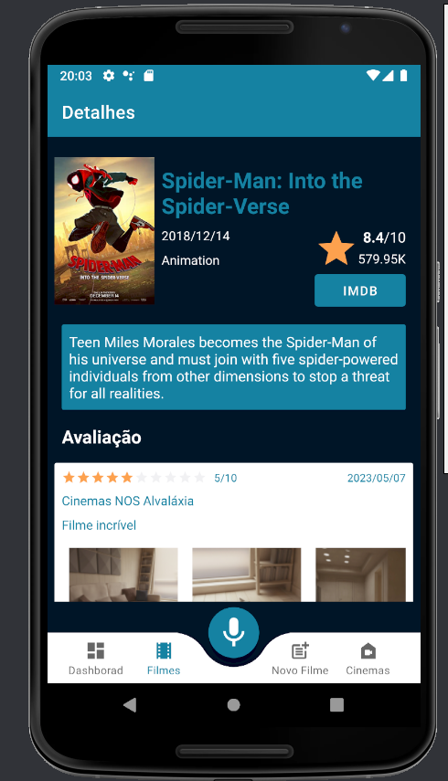
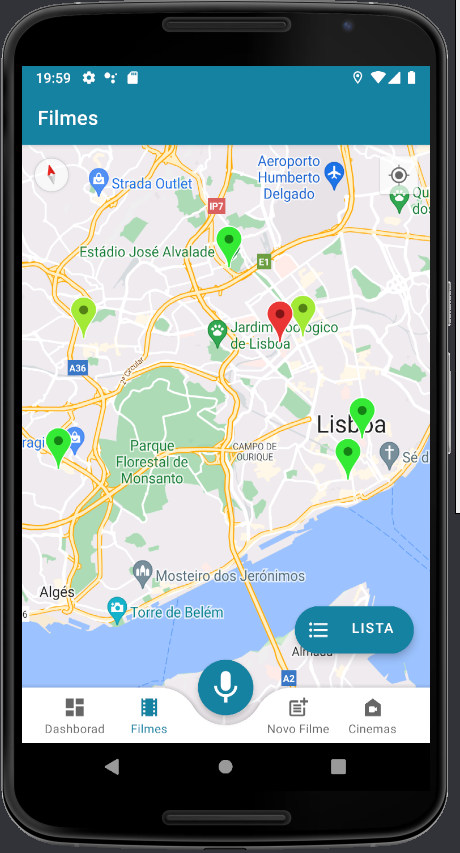
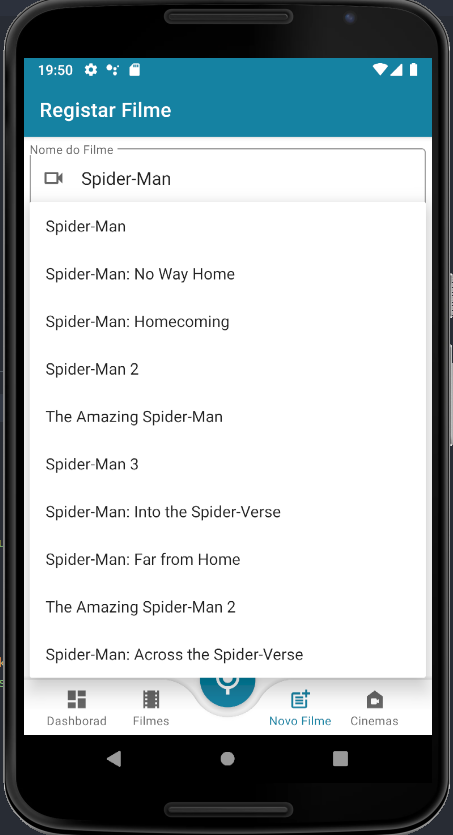
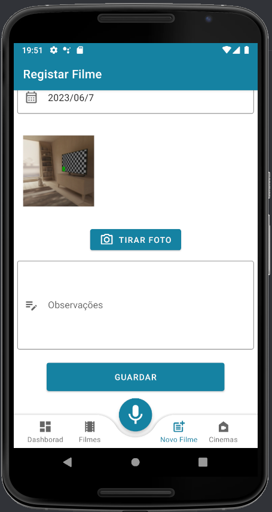
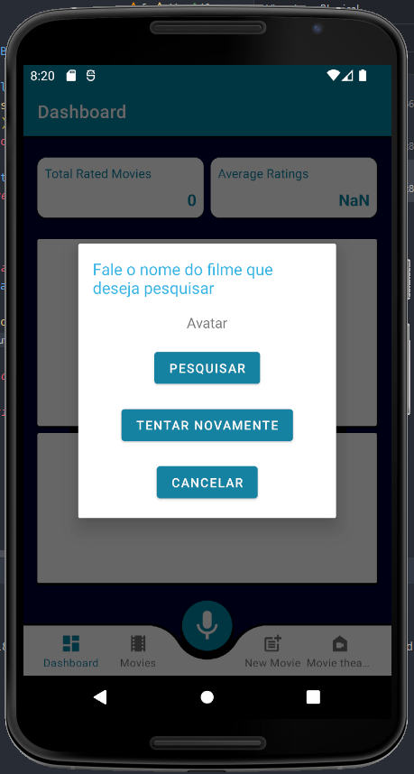
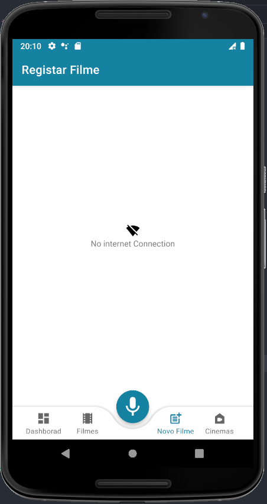
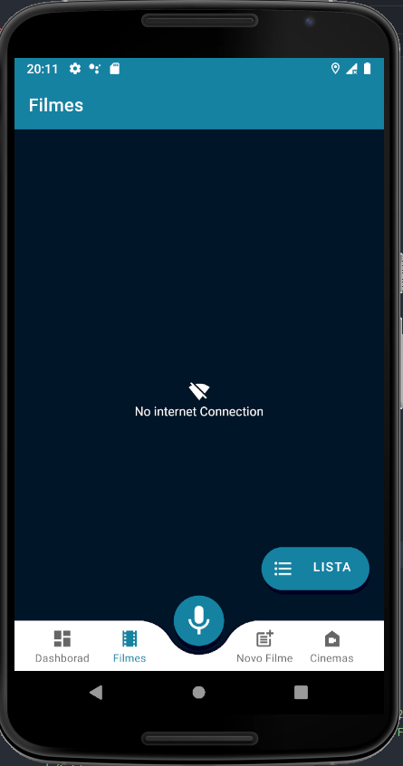
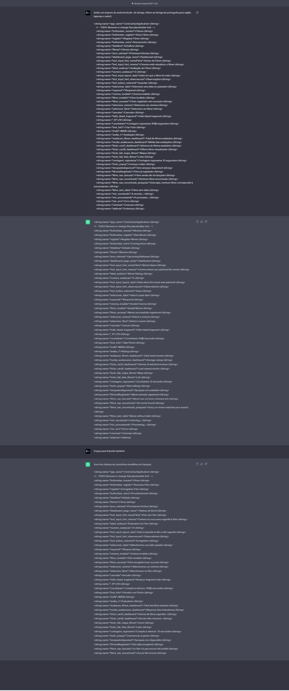

# Erick Pina a22006182
# Diogo Cerqueira a22002160
 

## Erro APK
Ao testar o apk num emulador na versão pedida no enunciado (API 23), obtive o erro abaixo, é preciso usar um emulador da API 28.

**'pm install-create -r -t --user current --full -S 20113695' returns error 'Unknown failure: Error: java.langNumberFormatException: Invalid int: "current"'**

## Erro microfone
Ao testar a funcionalidade de pesquisa por voz, não conseguimos utilizar o microfone do emulador com a API 28, 
só conseguimos com a API 31 (na API 28 dava erro de internet)

## Screenshots dos ecrãs

## Funcionalidades implementadas

Parte 1
- [x] Dashboard
- [x] Apresentação dos filmes -Lista
- [x] Apresentação dos filmes - Lista - Rotação
- [x] Apresentação dos filmes - Mapa (imagem)
- [x] Detalhe do filme (sem fotografias)
- [x] Detalhe do filme (apenas a parte das fotografias)
- [x] Pesquisa de filmes por voz
- [x] Registo de filmes (sem fotografias)
- [x] Registo de filmes (apenas a parte das fotografias)
- [x] Suporte multi-idioma
- [x] Extra

Parte 2
- [x] Registo de filmes
- [x] Inserir corretamente na base de dados
- [x] Validação e obtenção dos dados do filme via API
- [x] Validação e obtenção dos dados do cinema via JSON
- [x] Utilização de geo-localização
- [x] Inserir fotografias na base de dados
- [x] Apresentação dos filmes -Lista
- [x] Apresentação dos filmes - Mapa
- [x] Detalhe do filme (sem fotografias)
- [x] Detalhe do filme (apenas a parte das fotografias)
- [x] Pesquisa de filmes por voz - Funcionalidade Avançada
- [x] Dashboard
- [x] Funcionamento Offline - Funcionalidade Avançada
- [x] Video
- [x] Extra
- [x] Ficheiro chatgpt.txt (ver secção Requisito Bónus - Interação com chatgpt)

# AutoAvaliação

18.0

# Link do vídeo da demonstração da aplicação

https://youtu.be/MX3usI_oKVs

# Classes

Classe Filme:
- Atributos:
    * filmeId - String,
    * nome - String,
    * imagemCartaz - String,
    * genero - String,
    * sinopse - String,
    * dataLancamento - Date,
    * avaliacaoIMDB - Float,
    * numeroAvaliacoes - Int,
    * linkIMDB - String;

---

Classe Cinema:
- Atributos:
    * cinemaId - Int,
    * cinemaName - String
    * latitude - Double,
    * longitude - Double,
    * address - String,
    * postcode - String,
    * country - String;
    * foto - String,

---

Classe Opiniao:
- Atributos:
    * id - String,
    * avaliacao - Int,
    * dataTimeStamp - String,
    * observacoes - String,
    * filmeId - String,
    * cinemaId - Int;
  
---

- Classe FilmesActions:

    * abstract fun getFilmeByTitle(titulo: String, onFinished: (Result<Filme>) -> Unit) - Busca o filme na BD a partir do titulo do mesmo

    * abstract fun getFilmesBySearch(titulo: String, onFinished: (Result<List<String>>) -> Unit) - Busca o filme na BD a partir da API

    * abstract fun getFilmeById(filmeId: String, onFinished: (Result<Filme>) -> Unit) - Busca o filme na BD a partir do id do mesmo

    * abstract fun getFilmes(onFinished: (Result<List<Filme>>) -> Unit) - Busca todos os filmes da BD

    * abstract fun existsId(id: String, onFinished: (Result<Boolean>) -> Unit) - Verifica se o id passado como parametro ja existe na BD

    * abstract fun insertFilme(filme: Filme, onFinished: () -> Unit) - insere filme na BD

    * abstract fun clearAllFilmes(onFinished: () -> Unit) - Limpa a base de dados

---

- Classe CinemasActions:

  * abstract fun getCinemas(onFinished: (Result<List<Cinema>>) -> Unit) - busca todos os cinemas da BD
    
  * abstract fun insertCinema(cinema: Cinema, onFinished: () -> Unit) - insere cinema na BD
    
  * abstract fun clearAllCinemas(onFinished: () -> Unit) - Limpa a base de dados
    
  * abstract fun getCinemaById(id: Int, onFinished: (Result<Cinema>) -> Unit) - Busca o cinema na BD a partir do id do mesmo
    
  * abstract fun getCinemaByName(id: String, onFinished: (Result<String>) -> Unit) - Busca o cinema na BD a partir do nome do mesmo

---

- Classe OpinioesActions:
- 
  * abstract fun getOpinioes(onFinished: (Result<List<Opiniao>>) -> Unit) - busca todas as opinioes da BD
  
  * abstract fun insertOpiniao(opiniao: OpiniaoTable, onFinished: () -> Unit) - insere opiniao na BD
  
  * abstract fun clearAllOpinioes(onFinished: () -> Unit) - Limpa a base de dados
  
  * abstract fun getOpiniaoByFilmeId(filmeId: String, onFinished: (Result<Opiniao>) -> Unit) - Busca a opiniao na BD a partir do id do filme

---

- Classe FotosActions:
- 
  * abstract fun getFotos(onFinished: (Result<List<FotosTable>>) -> Unit) - busca todas as fotos da BD

  * abstract fun insertFoto(opiniaoId: String, foto: String, onFinished: () -> Unit) - insere foto na BD

  * abstract fun getByOpiniaoId(id: String, onFinished: (Result<List<String>>) -> Unit) - Busca a foto na BD a partir do id da opiniao

  * abstract fun clearAllFotos(onFinished: () -> Unit) - Limpa a base de dados

# Idioma gerado pelo ChatGPT

# Fontes de informação

https://www.youtube.com/watch?v=iEXh1-KVeVc - BottomBar
https://www.youtube.com/watch?v=5zp0nawlNr8&t=153s - Autocomplete
https://www.youtube.com/watch?v=4ou5yRJtuKU&t=1744s - Grafico de barras
https://www.youtube.com/watch?v=3LIXkNxUdhw - Read JSON
ChatGpt

- prompts de chatgpt
  
    * do not concatenate text displayed with settext. use resource string with placeholders
    * recyclerview ficar invisivel quando ta vazio
    * tenho um botão que usa a camera e a aplicacao crasha caso nao tenha permissao para a camera
    * quero carregar no botão submit e quero que veja se os valores obrigatórios tao preenchidos e caso não esteja que ponha um texto *Required
